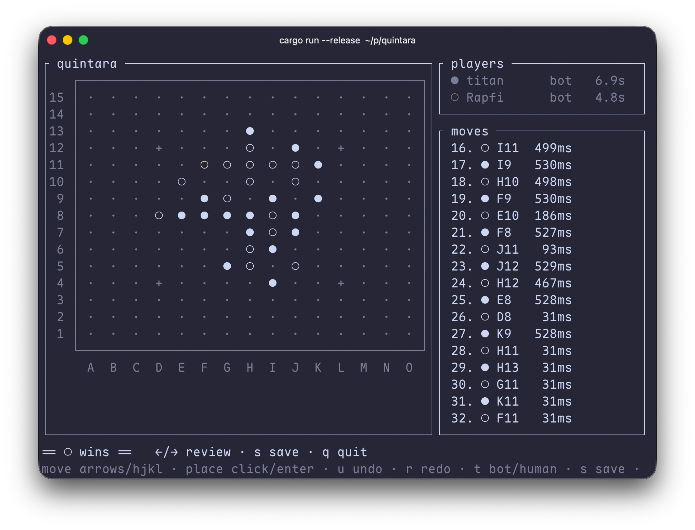

# quintara

A cross-platform Gomoku / Renju (五子棋) engine and match manager, written in Rust. A personal hobby project.

quintara lets you play Gomoku in the terminal: human vs human, human vs bot, and bot vs bot. It drives AI bots over the stdio [Gomocup protocol](./docs/protocol/gomocup.md), and handles rules, the clock, undo/redo, PSQ records, and opening setup. It starts as a command-line tool and already has an interactive TUI mode. A native macOS GUI in Swift may be added later, consuming the same engine over an FFI boundary.



Terms: **bot** = an AI player (code under `bots/`); **`pbrain-<name>`** = a bot built as a standalone stdio executable.

## Layout

The Rust side is the engine, a CLI/TUI front end, and a future library boundary for Swift:

```text
crates/                 # reusable library components
  model rules opening record protocol   # pure components (no I/O)
  bot                                   # write + run bots (MoveSource, serve, drive external pbrain)
  arbiter                               # single-game orchestration + the Player port (Human / built-in bot / external pbrain)
bots/<name>             # my bots: a lib (impl MoveSource) + a pbrain-<name> binary
apps/quintara-cli       # the `quintara` binary; text mode and the interactive TUI (src/tui.rs)
# A full GUI would be a separate Swift app, consuming the engine via FFI or the CLI.
```

See [`docs/architecture.md`](./docs/architecture.md) for details.

## Rules

Rule set, board size, and opening are three independent parameters (matching Gomocup's `-rule` / `-boardsize`). Four named rule sets (see [`docs/rules/`](./docs/rules/)):

| rule set | Gomocup `rule` | win | black forbidden moves |
| --- | --- | --- | --- |
| `freestyle` | 0 | five or more in a row (overline wins) | none |
| `standard` | 1 | exactly five | none |
| `renju` | 4 | black exactly five / white five or more | double-three, double-four, overline; draw at the move cap |
| `caro` | 8 | exactly five with at least one open end | none |

Coordinates use Gomocup `X,Y` (0-based) on the wire and in `.psq` records; the `H8` letter-number notation is for display and human input only. Board size and opening are chosen separately; the CLI `--size` defaults to 15.

## Documentation

- Rules: [`docs/rules/`](./docs/rules/) (freestyle / standard / renju / caro / openings / Gomocup events)
- Protocol: [`docs/protocol/`](./docs/protocol/) (Gomocup AI protocol)
- Third-party engine: [`docs/rapfi.md`](./docs/rapfi.md) (using Rapfi as a sparring opponent)
- Piskvork reference: [`docs/piskvork.md`](./docs/piskvork.md) (a desktop Gomoku manager worth studying)
- Architecture: [`docs/architecture.md`](./docs/architecture.md) · tech stack: [`docs/tech-stack.md`](./docs/tech-stack.md) · plan: [`docs/roadmap.md`](./docs/roadmap.md)
- Code and commit conventions: [`AGENTS.md`](./AGENTS.md)

## Plan

| stage | content | status |
| --- | --- | --- |
| P1 | Terminal single-game manager (incl. external pbrain): human/bot/bot-bot, debug your own bot, rules / PSQ / clock / undo | done |
| P2 | Interactive TUI board (play, review, undo/redo, save/load, swap seats) | done |
| P3 | Built-in bots: `sage` (1-ply shapes), `titan` (bitboard + α-β + VCF); `aegis` skeleton in progress | done / ongoing |
| P4 | Rules / protocol depth (swap2, Pro, Renju openings, full `INFO`) | next |
| P5 | FFI library boundary (for a Swift GUI) | later |
| P6 | Swift GUI (separate project, consumes the engine) | later |

Frozen until needed: ecosystem interop, ZIP bot unpacking, arena tournaments. See [`docs/roadmap.md`](./docs/roadmap.md).

## Quick start

```sh
cargo test --workspace        # all tests
just check                    # fmt-check + clippy + test gate

# Play a game: first --player is black, second is white.
cargo run -p quintara-cli -- match --player human --player builtin:titan --tui
```
