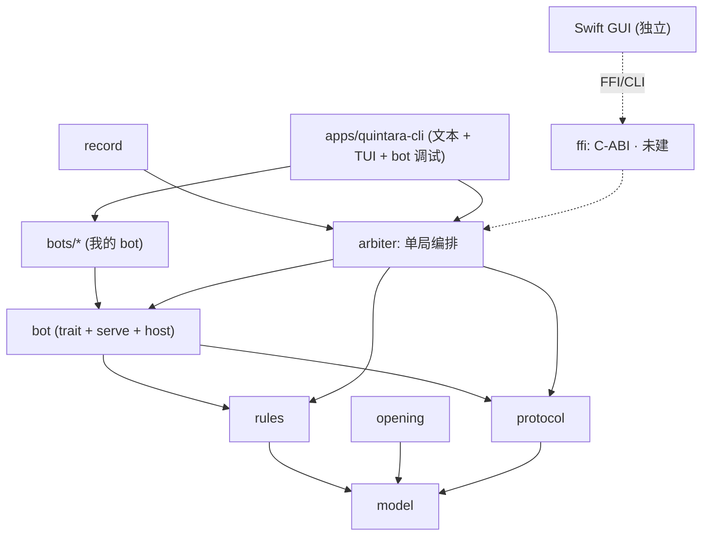

# 架构设计

本文档定义 **quintara** 的架构。规则与标准见 [`rules/`](./rules/)，协议见 [`protocol/`](./protocol/)，技术栈见 [`tech-stack.md`](./tech-stack.md)，实施计划见 [`roadmap.md`](./roadmap.md)。功能上参考的桌面管理器见 [`piskvork.md`](./piskvork.md)。

## 0. 目标

quintara 是一个**跨平台的五子棋对局引擎与管理器**，个人爱好项目：人对 AI、人对人、AI 对 AI；管理 AI（brain）的协议通信、计时、规则、存档；后续锦标赛。

**Rust 侧 = 引擎 + 命令行 / TUI 前端 + 将来给 GUI 的库边界**。最终 GUI **很可能用 Swift 另行实现**（macOS 原生），所以 Rust 侧**不急于做 GUI**：重点是把引擎做成一组**干净、可复用的库 crate**，并预留稳定的库边界（FFI / C-ABI，或经 CLI / 引擎库）供 Swift GUI 将来消费。**从命令行（CLI）起步。**

不做（至少初期）：网络对局 / 分布式锦标赛、Windows 注册表、自定义私有协议、Rust 端的正式 GUI。

## 1. 术语与核心原则

**术语（统一）：**

- **bot** — 一个 AI 机器人实现，代码在 `bots/`。**统一用这个词**，弃用 engine / agent 等同义词。
- **`pbrain-<name>`** — bot 的**独立可执行形态**，讲 stdio [Gomocup 协议](./protocol/gomocup.md)（沿用 Gomocup 的 "brain" 叫法）。
- 一个 bot 有两种部署：**(a) 静态编译进宿主**（进程内，仅范例 bot 这么用）；**(b) 独立 `pbrain-<name>` 可执行**，经 stdio 协议与主程序通信（**常见形态**）。
- **arbiter** — 单局对局的权威编排组件（沿用这个名字），职责类似 Piskvork 的 `game.cpp`。**前端** — cli / tui / 将来的 Swift GUI。

**核心原则：**

- **规则是纯函数、唯一权威**。`rules` 组件（合法性、胜负、连珠禁手）无 I/O、无随机；任何对局面的权威变更都经由 `apply_move` 这一个入口。
- **arbiter 是单局的权威编排者**。它持有权威 `GameState`，通过 `rules` 施加着法，管理时钟 / 悔棋 / 开局 / 终局判定。
- **玩家统一为一个端口 `Player`**：轮到谁 → `request(ctx)` → 反复 `poll()` 返回 `Pending` 或 `PlayerOutput`（`Move` / `Resign` / `Lost`）。**异步交付、不是同步算一手**——人类端口只「转交」前端喂来的手、不计算，故能与 bot 同形。三种实现差别只在端口内部「手从哪来」：
  - **HumanPlayer**：标记等待，前端把用户落子喂进来 → poll 返回；默认无实际时限。
  - **BuiltinPlayer**（内置 bot）：`LocalSession` 唤醒 worker 线程调 `bot::MoveSource` 计算；超 deadline → `Lost(Timeout)`。
  - **ExternalPlayer**（外部 pbrain）：经 `bot` 组件的 host 侧发 `BOARD` / `INFO`、读回着法；超时 / EOF → `Lost`。
- **协议只有一套：Gomocup stdio 文本协议**。`bots/` 下每个 bot 都支持它（编成 `pbrain-<name>`）。协议字节只在 `protocol` / `bot` 组件与 bot 自身内部，不外溢到前端。**不做**自定义协议。
- **细分纯函数 crate、便于复用**：规则 / 状态 / 棋谱等做成**小而纯**的独立 crate（无 I/O、无全局状态），既给本项目用，也方便将来被其它工具或 **Swift GUI 经 FFI** 复用。
- **前端是可替换的宿主**：Rust 前端（CLI / TUI）嵌入 `arbiter`，负责渲染与人类输入、不含规则。
- **棋盘是 `width × height`**（默认正方形，支持矩形 / Gomocup `RECTSTART`）。坐标用 Gomocup `X,Y`（0 基）。
- **跨平台**：进程 / 管道用 `std`；配置用文件（非注册表）。

## 2. 分层与依赖

分三类：**组件**（`crates/`，可复用库）、**我的机器人**（`bots/`，基于组件构建）、**应用**（`apps/`，组合组件成产品）。

```text
组件 crates/（细分、纯、可复用——也供将来 Swift GUI 经 FFI 复用）
  model     纯类型：Board(width×height) / Color / Position / Move / GameState / TurnContext / 坐标(X,Y)
  rules     纯规则：apply_move / legal_moves / is_win_for / 连珠禁手 / caro；RuleSet、Outcome
  opening   纯开局：Opening::None / Fixed + auto(count,size)（作用于局面；Swap/Swap2/连珠系统留后续）
  record    棋谱：PSQ / REC 读写、事件投影（依赖 model + arbiter）
  protocol  Gomocup 协议编解码（Command / Reply / field 棋盘 / X,Y）；纯，无 I/O
  bot       **写 bot 与跑 bot 的一站式 crate**：
              · MoveSource trait（next_move(ctx, stop) -> Move）+ StopFlag（协作取消）—— 写 bot 用
              · serve(bot, name)：把 bot 跑成 pbrain-<name> 的 stdio 适配 —— 写 bot 用
              · spawn(cmd) -> ExternalBot：host 侧拉起并驱动外部 pbrain（子进程 / 管道 / 超时）—— arbiter 用
            **我自己的 Rust bot 就依赖这一个 crate**；协议字节只在 protocol / bot 内
  arbiter   单局权威编排：持 GameState；统一 Player 端口（HumanPlayer / BuiltinPlayer / ExternalPlayer 同形）；
            MatchConductor 主循环、时钟、Rewind 悔棋、开局摆子、swap_seat 换座位；前端无关

我的机器人 bots/（依赖 bot crate）
  <name>/   每个 bot 一个：lib(impl bot::MoveSource) + pbrain-<name> bin(用 bot::serve 讲 stdio)
            random / greedy / sage / titan / aegis 各自独立；rapfi 是外部 C++ 引擎适配（不在 workspace）

应用 apps/
  quintara-cli   `quintara` 二进制：文本对弈 + 交互式 TUI（src/tui.rs，ratatui）+ bot 开发 / 调试
                 —— 全功能 GUI 是独立的 Swift 应用（不在本 workspace），经下面的 FFI / CLI 消费同一引擎

将来（未建）
  arena     锦标赛：多局 + 统计 + 结果表（复用 arbiter）
  ffi       cdylib / staticlib + C-ABI，供 Swift GUI 链接
```

依赖方向单向（已与代码核对）：

- 纯组件 `model` / `rules` / `opening` / `protocol` 互相只依赖更底层，**无 I/O、无全局状态**。
- `bot` 依赖 `model` + `rules` + `protocol`（含子进程的 host 侧 + `serve` 适配）；**协议字节不外露**。
- `bots/<name>` 依赖 `bot`（+ `rules` / `model` 按需）。
- `arbiter` 依赖 `model` + `rules` + `bot` + `protocol`（用 `MoveSource` / `ExternalBot` 装配 `Player` 端口；`protocol` 仅供 `ExternalPlayer` 内部构造 `BOARD` / `INFO`，不出端口）。
- `apps/quintara-cli` 依赖 `arbiter` + 各组件 + 各 `bots/<name>`（作内置对手）+ `clap` / `ratatui`。
- `record` 依赖 `model` + `arbiter`（投影对局事件成棋谱）。
- Swift GUI（独立）将经 `ffi` 链接引擎，或驱动 `cli`。



## 3. 关键接口（语言无关形状）

### 3.1 纯组件（model / rules / opening）

```text
Color    = Black | White
Position = { row, col }              # 0 基
Board    = { width, height, cells }  # 默认正方形
Move     = Place(Position)
GameState = { board, side_to_move, move_history }
TurnContext = { board, side_to_move, move_history, legal_moves, rule_set, timeout_turn, time_left }

RuleSet  = freestyle | standard | renju | caro  # 含 win_rule / forbidden_black / max_moves；不含棋盘大小
Opening  = None | Fixed([Position])             # auto(count, size) 生成居中预设；正交维度

Outcome  = Win(Color) | Draw | Continue
apply_move(state, move, rule_set) -> Applied | MoveError   # 唯一落子入口
legal_moves(state, rule_set) -> [Move]                     # 受禁手约束方剔除禁手点
is_win_for(board, pos, rule_set, color) -> bool
```

`win_rule` / `forbidden_black` / `max_moves` 覆盖 freestyle / standard / renju / caro。棋盘大小是与 `RuleSet` 正交的独立参数。这几个 crate 是**纯组件**——无 I/O、无全局状态，便于被 `arbiter`、`bot`、`bots/`、未来 Swift FFI 复用。

### 3.2 arbiter（单局编排）

统一的玩家端口（三种实现同形）：

```text
trait Player {
  request(ctx)                       # 轮到你了
  poll() -> Pending | Ready(PlayerOutput)   # 非阻塞查结果
  stop()                             # 超时 / 取消
  supply(pos)                        # 人类端口：前端喂手
}
PlayerOutput = Move(Position) | Resign | Lost(PlayerLostKind)   # Lost: Timeout / Crash / Disconnect / ...
实现（都在 arbiter 内）：HumanPlayer（前端喂手）/ BuiltinPlayer（包 LocalSession + MoveSource worker 线程）/ ExternalPlayer（包 bot::ExternalBot）

MatchConductor:
  new(rule_set, size, black: SeatConfig, white: SeatConfig)
  with_opening([Position])           # 预摆开局子
  tick(human_input) -> Step          # 推进一步：轮到某方 → request → poll → 落子 / 判负 / 终局；产出事件
  swap_seat(color, config) -> Step   # 中途更换某色的人 / 机
  run_to_completion() / run_with(on_event) / run_interactive(...)
```

主循环对所有 seat 只有一条路径，**不区分人 / 机**：轮到某方 → `player.request(ctx)` → 每个 `tick` 里 `poll`，得 `Ready` 就经 `rules` 落子 / 判负、推进回合，超 deadline 则 `stop()` 后判 `Lost(Timeout)`。**Rewind 悔棋**靠从初始局面（含开局子）重放到指定 ply 重建局面，不需要协议 `TAKEBACK`。终局、开局摆子、换座位都在 arbiter。

### 3.3 bot 组件（写 bot + 跑 bot 的一站式 crate）

`quintara-bot` 把「写 bot」和「跑 bot」合到一处，依赖 `model` + `rules` + `protocol`：

- **写 bot（我的 Rust bot 依赖这部分）**：`MoveSource` trait（`next_move(ctx, stop) -> Move`）+ `StopFlag`（协作取消）；`serve(bot, name)`——一个 stdio 主循环，把任意 `MoveSource` 跑成讲 [Gomocup 协议](./protocol/gomocup.md) 的 `pbrain-<name>` 可执行（`START / INFO / BEGIN / TURN / BOARD / END / ABOUT`）。
- **跑 bot（arbiter 用这部分）**：`spawn(cmd) -> ExternalBot`——host 侧拉起并驱动外部 `pbrain-*`：双管道行帧、发送命令、非阻塞读回着法、每手超时。

协议字节只在 `protocol` / `bot` 内。arbiter 把 `MoveSource` 或 `ExternalBot` 包成统一的 `Player` 端口。

### 3.4 应用与前端

- **`apps/quintara-cli`**：`quintara` 二进制 = **对局管理器 + bot 开发 / 调试工具**。`match` 子命令支持人人 / 人机 / 机机对战、悔棋、存读 PSQ；`--tui` 进交互式 ratatui 棋盘（落子、悔棋 / 重做、存档、回看、`t` 换座位）；`show` 查看 PSQ 棋谱。player spec：`human` | `builtin:<name>` | 外部 pbrain 命令。子命令与参数见 [`roadmap.md`](./roadmap.md)。
- **Swift GUI（独立、全功能）**：不在本 workspace；将经 `ffi`（C-ABI 链接引擎库）或驱动 `cli` 消费同一引擎。
- 所有前端都只「驱动 arbiter + 渲染 + 收人类输入」，不含规则。

## 4. 跨阶段不变量

1. **规则纯、唯一权威**：着法合法性、胜负、禁手只由 `rules` 裁决；`apply_move` 是唯一落子入口，arbiter 是唯一权威调用方。
2. **协议只在 `protocol` / `bot` 内**：Gomocup 文本协议不外溢到前端；`arbiter` 仅在 `ExternalPlayer` 内部用它驱动子进程。
3. **arbiter 前端无关**：cli / tui / Swift GUI 可替换，互不影响 arbiter 与各组件。
4. **玩家统一为 `Player` 端口**（request + poll 异步交付）：Human / 内置 bot / 外部 pbrain 对 arbiter 同形，差别只在端口内部取手路径与失败模式。
5. **术语统一**：bot（AI 机器人，在 `bots/`）/ `pbrain-<name>`（其 stdio 可执行形态）；不混用 engine / agent / brain 指代 bot。
6. **棋盘大小、规则、开局是三类正交参数**（与 Gomocup `-boardsize` / `-rule` / 开局一致）。
7. **坐标 `X,Y`（0 基）**全程统一；PSQ 导出转 1 基。
